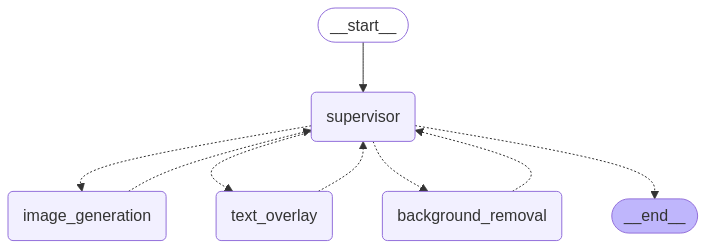

# Multi-Agent Image Processing System

A LangGraph-based system that coordinates multiple AI agents for image processing tasks using the Agent-Supervisor pattern.

## Overview

This project implements a multi-agent system based on LangGraph's Agent-Supervisor pattern, where a supervisor agent coordinates multiple specialized image processing agents. The system demonstrates the use of LangGraph's edgeless graph architecture and Command construct for agent coordination.

### System Architecture



The system consists of:

1. **Supervisor Agent**
   - Coordinates the workflow
   - Makes intelligent decisions about task sequencing
   - Routes requests to appropriate agents using LangGraph's Command construct

2. **Task Agents**
   - Image Generation Agent: Handles image creation requests
   - Text Overlay Agent: Adds text to images
   - Background Removal Agent: Removes image backgrounds

The graph visualization above shows:
- The initial entry point (START) connecting to the Supervisor
- The Supervisor node which coordinates all task agents
- Task agent nodes for specific image processing operations
- The potential paths through the system based on user requests

### Key LangGraph Features Used

1. **Edgeless Graph Architecture**
   - Instead of explicit edges between nodes, routing is handled by agent Commands
   - Each agent returns a Command that specifies the next agent to run
   - Simplifies graph structure and makes it more flexible

2. **Command Construct**
   ```python
   Command(
       goto="next_agent",
       update={
           "next_agent": "next_agent",
           "current_task": "current_task",
           "messages": [...],
       }
   )
   ```
   - `goto`: Specifies the next agent to execute
   - `update`: Updates the state that's passed between agents

3. **StateGraph**
   ```python
   builder = StateGraph(AgentState)
   builder.add_node("supervisor", create_supervisor_agent())
   builder.add_edge(START, "supervisor")
   ```
   - Manages state transitions between agents
   - Only requires initial edge from START to supervisor

## Setup

1. Create a virtual environment:

```bash
python -m venv venv
source venv/bin/activate  # On Windows: venv\Scripts\activate
```

2. Install dependencies:

```bash
pip install -r requirements.txt
```

3. Create a `.env` file with your OpenAI API key:

```
OPENAI_API_KEY=your-key-here
```

## Running the System

From the project root directory, run:

```bash
python -m src.main
```

Example inputs to try:
- "Generate an image of a sunset and add text 'Beautiful Evening' to it"
- "Create an image of a mountain landscape and remove its background"
- "Generate an image of a cat with 'Hello' text"

The system will:
1. Take your input
2. Use the supervisor to determine the sequence of tasks
3. Route the request through appropriate agents
4. Show the execution path and final result

## Project Structure

```
image_processing_agents/
├── src/
│   ├── agents/
│   │   ├── supervisor.py      # Supervisor agent implementation
│   │   ├── image_generation.py
│   │   ├── text_overlay.py
│   │   └── background_removal.py
│   ├── agent_types/
│   │   └── state.py          # State type definitions
│   ├── config/
│   │   └── settings.py       # Configuration settings
│   └── main.py              # Main execution script
├── .env                     # Environment variables
├── .gitignore
└── requirements.txt
```

## Implementation Details

1. **State Management**
   - Uses TypedDict for type-safe state management
   - Tracks messages, current task, and image URLs
   - Maintains execution history

2. **Agent Communication**
   - Agents communicate through state updates
   - Each agent adds its actions to the message history
   - Supervisor makes decisions based on complete context

3. **Routing Logic**
   - Supervisor analyzes both original request and current state
   - Makes sequential decisions about task execution
   - Uses LLM to understand complex requests

## Based On
This implementation follows the LangGraph Agent-Supervisor tutorial:
[LangGraph Multi-Agent Tutorial](https://langchain-ai.github.io/langgraph/tutorials/multi_agent/agent_supervisor/)